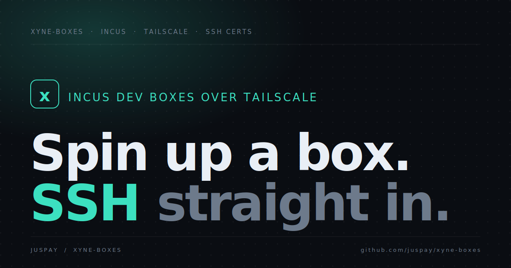

<div align="center">



# xyne-boxes

**Remote dev boxes, one SSH away.**

Incus-backed development boxes on Tailscale, with short-lived SSH certificates for login.

[**Website & setup guide →**](https://juspay.github.io/xyne-boxes/)

</div>

---

## Quick start

Requires [Tailscale](https://apps.apple.com/ca/app/tailscale/id1475387142?mt=12) and being on the VPN — see the [full guide](https://juspay.github.io/xyne-boxes/).

```sh
# 1. Join the network
sudo tailscale up --login-server=https://headscale.nixos.asia --hostname $(hostname -s)

# 2. Create a box
nix run github:juspay/xyne-boxes create <name>

# 3. Connect
nix run github:juspay/xyne-boxes connect <name>
```

Prefer plain `ssh <name>`? Wire the generated config into `~/.ssh/config` once:

```sh
grep -qxF 'Include ~/.pu-state/*/ssh_config' ~/.ssh/config 2>/dev/null \
  || { mkdir -p ~/.ssh && printf '\nInclude ~/.pu-state/*/ssh_config\n' >> ~/.ssh/config; }
```

## Renewing an expired certificate

SSH certificates are valid for **one week**. When yours expires you'll see:

```
pu@pu: Permission denied (publickey,keyboard-interactive).
Connection closed by UNKNOWN port 65535
```

Run `nix run github:juspay/xyne-boxes connect`, authenticate via Google (device flow at
[google.com/device](https://www.google.com/device)), and SSH in as usual. See the
[renewal guide](https://juspay.github.io/xyne-boxes/#renew) for details.

## Commands

| Command | Description |
| --- | --- |
| `create <name>` | Create an instance and print a connect command |
| `fork <source> <name>` | Fork an existing instance |
| `connect <name>` | Connect to an instance via SSH |
| `destroy <name> [name ...]` | Destroy one or more instances |
| `list` | List your instances |
| `version` | Print bash, ssh, and step-cli versions |

## The website

The [site](https://juspay.github.io/xyne-boxes/) lives in [`site/`](site/) and deploys to
GitHub Pages via [`.github/workflows/pages.yml`](.github/workflows/pages.yml).
